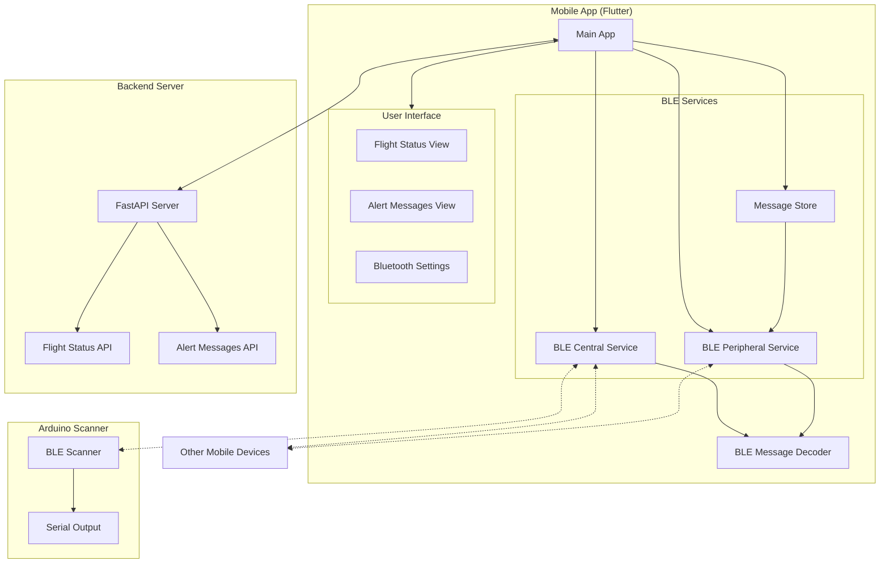

# VuelingConnect


> A decentralized communication network for travelers during connectivity outages

[](https://opensource.org/licenses/MIT)

## 📱 Overview

VuelingConnect is a Flutter application that enables travelers to share critical flight information during network outages using Bluetooth Low Energy (BLE) technology. The app creates an ad-hoc mesh network between devices, allowing information to propagate without requiring internet connectivity.

## ✨ Features

- **Decentralized Communication**: Share flight updates without internet connectivity
- **Battery Efficient**: Uses BLE broadcasting instead of connections to minimize power consumption
- **Mesh Network**: Messages hop between devices to extend range
- **Prioritized Updates**: Critical information propagates first based on timestamp and hop count
- **Gamification**: Rewards users for participating in the network
- **User-Friendly Interface**: Simple design for ease of use during stressful situations
- **Notifications**: Custom notification system with priority handling
- **Arduino Scanner**: Custom BLE scanner for Arduino 101 for signal strength

## 🏗️ Architecture



## 🚀 Getting Started

### Prerequisites

- Flutter 3.0+
- Dart 2.17+
- Android Studio / VS Code
- Android device with BLE support or iOS device

### Installation

1. Clone the repository
   ```bash
   git clone https://github.com/yourusername/vuelingconnect.git
   ```

2. Navigate to the project directory
   ```bash
   cd vuelingconnect
   ```

3. Install dependencies
   ```bash
   flutter pub get
   ```

4. Run the app
   ```bash
   flutter run
   ```

## 💡 Inspiration

The inspiration for VuelingConnect came from the recent blackout in Spain, which highlighted the vulnerability of communication systems during power outages. We wanted to create a solution that would allow travelers to stay informed about their flights even when traditional communication channels are unavailable.

## 🛠️ Technical Details

### Message Format

```
Binary Format:
[1 byte] msg_type: 
         - FlightStatus (0)
         - Alert (1)
[1 byte] hopCount: Number of times this message has been relayed

If msgType == FlightStatus:
  [8 bytes] flightNumber: ASCII encoded, padded with zeros
  [1 byte]  status: 
            - Scheduled (0)
            - Departed (1)
            - Arrived (2)
            - Delayed (3)
            - Cancelled (4)
  [4 bytes] timestamp: Epoch seconds, big-endian

If msgType == Alert:
  [1 byte]  alertType:
            - Evacuation (0)
            - Fire (1)
            - Medical (2)
            - Aliens (3)
  [4 bytes] timestamp: Epoch seconds, big-endian
```

### Relay Order Priority

- **Timestamp (Newest First)**: Ensures the most recent information propagates first
- **Hop Count (Lowest First)**: Prioritizes messages that haven't traveled as far
- **Rotation**: Round-robin scheduling for all eligible messages

## 🔮 Future Plans

- Real-time translation for international travelers
- In-flight communication capabilities
- Integration with airport information systems
- Expanded emergency response features

## 👥 Contributors

- [Miguel López](https://github.com/migueldeoleiros)
- [Mateo Amado](https://github.com/mateo19182)
- [Martín García](https://github.com/martinge17)
- [Juan Villaverde](https://github.com/JuanVillaverdeRodriguez)

## 📄 License

This project is licensed under the MIT License - see the [LICENSE](LICENSE) file for details.
