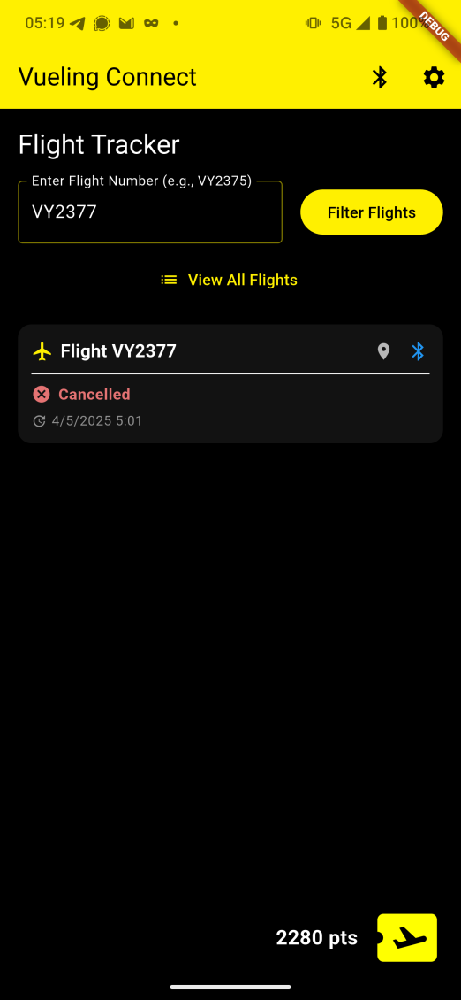

# VuelingConnect


> A decentralized communication network for travelers during connectivity outages

[](https://opensource.org/licenses/MIT)

## 📱 Overview

VuelingConnect is a Flutter application that enables users to share critical information during network outages using Bluetooth Low Energy (BLE) technology. The app creates an ad-hoc mesh network between devices, allowing information to propagate without requiring internet connectivity.

## ✨ Features

- **Decentralized Communication**: Share events without internet connectivity, with other devices acting as relays for messages.
- **Battery Efficient**: Uses BLE broadcasting instead of connections to minimize power consumption
- **Prioritized Updates**: Critical information propagates first based on timestamp and hop count
- **Gamification**: Rewards users for contributing to the network
- **User-Friendly Interface**: Simple design for ease of use during stressful situations
- **Arduino Scanner**: Arduino BLE scanner for seeing active devices and signal stregth
- **Notifications**: Custom notification system with priority handling

## 💡 Inspiration

The inspiration for VuelingConnect came from the Vueling prompt at [HackUPC2025](https://hackupc.com/). After the recent blackout in Spain, which highlighted the vulnerability of communication systems during power outages, we wanted to create a solution that would allow travelers to stay informed about their flights even when traditional communication channels are unavailable.

## 🛠️ Technical Details

### BLE Protocol

BLE devices either **advertise** (as peripherals) or **scan/connect** (as centrals).  

Peripherals broadcast short `ADV_*` packets on 3 channels (37, 38, 39). 

Optionally, a scanner may reply with `SCAN_REQ`, triggering a `SCAN_RSP` response (another 31-byte payload). This can be useful for showing more info without connecting.

If a central wants to connect, it sends a `CONNECT_REQ`. Both devices then switch to a private data channel set and begin exchanging data using the BLE protocol stack.

> BLE 5 adds extended advertising with bigger packets (~255 bytes) and new channels, but not all devices support it yet.

In our case messages are embedded into the ManufacturerSpecificData and broadcasted as part of the advertising step:

https://github.com/migueldeoleiros/vuelingconnect/blob/1d94af0159aaa0443bb974151c612f786eb30e9e/client/lib/services/ble_peripheral_service.dart#L55

The id is used to recognice devices in that are part of our network.
Data is kept under 26 bytes as to preserve [compatibility](https://stackoverflow.com/questions/33535404/whats-the-maximum-length-of-a-ble-manufacturer-specific-data-ad#:~:text=So%20there%20is%20no%20limit,31%20bytes%20for%20scan%20response) with as many devices as possible, though newer devices can usually use up to 250.

At the moment this is not using `SCAN_RSP` as to reduce the number of packets sent and maximize compatibility, so there is no confirmation if any other device has received one of your broadcasted packets. Because of that it's important to have careful queue managment to avoid redundancies in the network and ensure important messages are always relayed.

### Message Format

```
Binary Format:
[1 byte] msg_type: 
         - FlightStatus (0)
         - Alert (1)
[1 byte] hopCount: Number of times this message has been relayed

If msgType == FlightStatus:
  [8 bytes] flightNumber: ASCII encoded, padded with zeros
  [1 byte]  status: 
            - Scheduled (0)
            - Departed (1)
            - Arrived (2)
            - Delayed (3)
            - Cancelled (4)
  [4 bytes] eta: Estimated Time of Arrival in epoch seconds, big-endian (0 if not available)
  [3 bytes] destination: IATA airport code, ASCII encoded, padded with zeros
  [4 bytes] timestamp: Epoch seconds, big-endian

If msgType == Alert:
  [1 byte]  alertType:
            - Evacuation (0)
            - Fire (1)
            - Medical (2)
            - Aliens (3)
  [4 bytes] timestamp: Epoch seconds, big-endian
```

### Relay Order Priority

- **Msg Type**: Alerts have priority over flight updates.
- **Timestamp (Newest First)**: Ensures the most recent information propagates first
- **Hop Count (Lowest First)**: Prioritizes messages that haven't traveled as far
- **Rotation**: Round-robin scheduling for all eligible messages

## 🏗️ Architecture


## 🚀 Getting Started

### Prerequisites

- Flutter 3.0+
- Dart 2.17+
- Android Studio / VS Code
- Android device with BLE support or iOS device

### Installation

1. Clone the repository
   ```bash
   git clone https://github.com/yourusername/vuelingconnect.git
   ```

2. Navigate to the project directory
   ```bash
   cd vuelingconnect
   ```

3. Install dependencies
   ```bash
   flutter pub get
   ```

4. Run the app
   ```bash
   flutter run
   ```


## 👥 Contributors

- [Miguel López](https://github.com/migueldeoleiros)
- [Mateo Amado](https://github.com/mateo19182)
- [Martín García](https://github.com/martinge17)
- [Juan Villaverde](https://github.com/JuanVillaverdeRodriguez)

## Photos

<table>
  <tr align="center">
    <td width="33%">
      
    </td>
    <td width="33%">
      
    </td>
    <td width="33%">
      
    </td>
  </tr>
  <tr align="center">
    <td width="33%">
      
    </td>
    <td width="33%">
      
    </td>
    <td width="33%">
      
    </td>
  </tr>
  <tr align="center">
    <td width="33%">
      
    </td>
    <td width="33%">
      
    </td>
    <td width="33%">
            
    </td>
  </tr>
</table>

## 📄 License

This project is licensed under the MIT License - see the [LICENSE](LICENSE) file for details.
